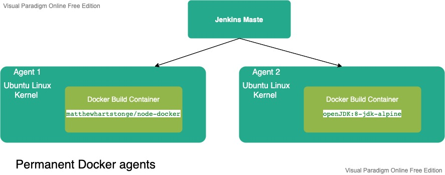

## Emaginer Continuous Delivery Pipeline

### Startup and configuration  
1. Start Jenkins Master: in a distributed build environment the Jenkins Master is responsible for:
 - Receiving build triggers (e.g. after a commit to Github)
 - Sending notifications 
 - Handling HTTP requests from the admin console
 - Orchestrate the job executions on agents
Run/start the Jenkins container (remove --rm to persist the container)
 `docker run --rm -d --name jenkins_blueocean -u root -p 8080:8080 -v jenkins-data:/var/jenkins_home -v /var/run/docker.sock:/var/run/docker.sock -v "$HOME":/home jenkinsci/blueocean
 `
**_note:_** this is the jenkins_blueocean release, for the old release we should mount a different volume (jenkins_home:/var/jenkins_home). 
We can access the Jenkins container file system (volume mounted to the container var/jenkins_home, which is actually
mapped to a folder in the HyperKit VM that Docker desktop uses to run containers, to see  Jenkins files for example) by
 running a privileged container which allows to access that hidden VM from our macOS, from the fundamentalsofdocker/nsenter image.
 `
docker run -it --rm --privileged --pid=host fundamentalsofdocker/nsenter
/ # cd /var/lib/docker/volumes/jenkins-data
`
2. Configure Jenkins Master:  
	- Configuring permanent agents (Permanent, general-purpose Docker agents. ideally, in production environment, we should
 configure a dynamic, general-purpose Docker agents using Cloud feature)
 in the admin console=> Manager Jenkins => Manage Nodes and Clouds => New Node => Remote root directory: /tmp/jenkins-agent1, Launch agent by connecting it to the master.  
   
 We need to install Docker on each agent machine. Then, we usually don't need labels, because all the agents can be the same (general-purpose).
 We define the Docker image that will be run by the Jenkins agent in the pipeline project (i.e. each project can have
 different image depending upon the project but all can be run on any of the permanent agents). 
 When the build is started, the Jenkins agent starts a container from the Docker image specified in the pipeline, 
 and then executes all the pipeline steps inside that container (the Jenkins agent itself is not running in a container
  but it will spawn a container to execute the build)
  
 1. When the Jenkins job is started, the master runs, on the agent machine, a new container from the image defined in the agent cloud template (jenkins-slave). 
 2. The jenkins-slave container is actually the Ubuntu image with the sshd server installed (to allow the master to connect to the agent machine) 
 3. The Jenkins master automatically adds the created agent to the agent list 
 4. After the build, the master stops and removes the agent container
 This configuration is similar to the Permanent docker agents because the build is run inside a Docker container. 
 The difference, however, is the whole agent is dockerized, not only the build environment (allowing for an automatic 
 lifecycle of the agents and scalability).
 
	- Connect agent to Jenkins Master by:
		- Downloading the JAR from the Jenkins console => Manager Jenkins => Manage Nodes and Clouds => agent1 => in the second option "Run from agent command line"
		- Copy the JAR from the download folder to the Jenkins Master container using 
			`
			docker cp /Users/tmuhader/Downloads/agent.jar containerID:/tmp/download/
			`
		- Connect to the Jenkins Master container using:  
			`
			docker exec -it containerID /bin/sh
			`
		- Execute the following command (mentiond in the Jenkins Web console) from the /tmp/download/ folder where the JAR is located:  
			`
			java -jar agent.jar -jnlpUrl http://localhost:8080/computer/agent1/slave-agent.jnlp -secret de3cdd24c5305bec49fd163c87331625030ad49ddeedbb365f6a986d04bb729c -workDir "/tmp/jenkins-agent1"
			`
		
	- When the agents are setup correctly, it's possible to update the master node configuration with "# of executors" set to 0
so that no builds will be executed on it.

### CI (Commit) Stage
1. Configure the build trigger (external by Githb) and notifications in Jenkins
2. push the code to the remote repository (to the feature branch (Head branch) then when merged with the main (Base branch))
3. CI process will be triggered by the commit pipeline by running the checkout, build, unit tests and possible code quality