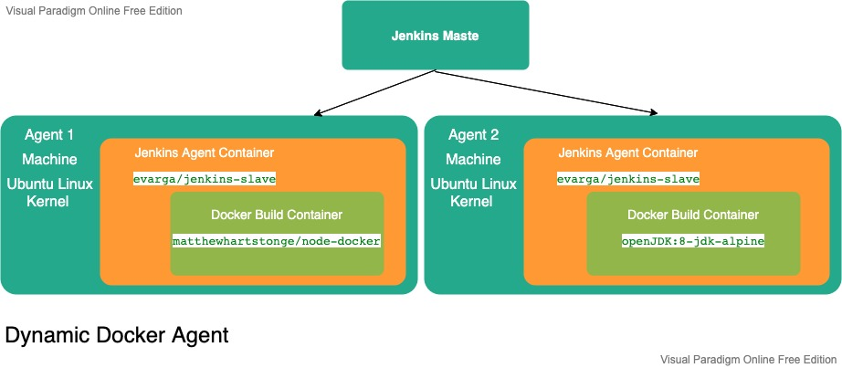

# Emaginer Continuous Delivery Pipeline

## Startup and configuration  
**Jenkins Master:** in a distributed build environment the Jenkins Master is responsible for:  
    - Receiving build triggers (e.g. after a commit to Github)  
    - Sending notifications   
    - Handling HTTP requests from the admin console  
    - Orchestrate the job executions on agents  
1. Start Jenkins Master  
Run/start the Jenkins container (remove --rm to persist the container)  
 `docker run --rm -d --name jenkins_blueocean -u root -p 8080:8080 -v jenkins-data:/var/jenkins_home -v /var/run/docker.sock:/var/run/docker.sock -v "$HOME":/home jenkinsci/blueocean
 `  
 the Java Web Start agent uses port 50000 for communication with Jenkins Master, therefore, since we're using the Docker-based Jenkins master,
 we need to publish that port (-p 50000:50000)  
 Otherwise, if the container already exist in the local machine, start the Jenkins container:  
 `
 docker start jenkins_blueocean
 `  
 **_note:_** this is the jenkins_blueocean release, for the old release we should mount a different volume (jenkins_home:/var/jenkins_home). 
We can access the volume mounted to the container (jenkins-data), which is actually a folder in the HyperKit VM that Docker desktop uses to run containers, to see  Jenkins files for example
 by running a privileged container which allows to access that hidden VM from our macOS, from the fundamentalsofdocker/nsenter image.  
``
docker run -it --rm --privileged --pid=host fundamentalsofdocker/nsenter
/ # cd /var/lib/docker/volumes/jenkins-data
``  
or by accessing the container file system:   
``
docker exec -it containerID /bin/sh -c "ls /var/jenkins_home"    
``  
2. Create and Configure Jenkins Agents:  
	- Configuring permanent agents (Permanent, general-purpose Docker agents. ideally, in production environment, we should
 configure a dynamic, general-purpose Docker agents using Cloud feature). 
        - In the admin console=> Manager Jenkins => Manage Nodes and Clouds => New Node => 
        - Remote root directory: /tmp/jenkins-agent1, 
        - Launch agent by connecting it to the master.  
        
 **Permanent, general-purpose Docker agents**  
 
   1. We need to install Docker on each agent machine. Then, we usually don't need labels, because all the agents can be the same (general-purpose).
 We define the Docker image that will be run by the Jenkins agent in the pipeline project (i.e. each project can have
 different image depending upon the project but all can be run on any of the permanent agents). 

   2. When the build is started, the Jenkins agent starts a container from the Docker image specified in the pipeline, it must contain:  
    - NodeJS to execute npm install command (from Build stage)   
    - Docker CLI to execute Docker commands (from Build image & push it to DockerHub stage, so here Docker container running Docker commands).   
    We are using the image "matthewhartstonge/node-docker", alternatively, we can create
 our image from a Dockerfile (based on Node and we add Docker CLI) and push it to Docker registry (see the example builder-container_2_6 in the dockerBook project)  
 
   3. The Jenkins agent then executes all the pipeline steps inside that container (the Jenkins agent itself is not running in a container
  but it will spawn a container to execute the build)    
   
   
**Dynamic, general-purpose Docker agents**  
   1. When the Jenkins job is started, the master runs, on the agent machine, a new container from the image defined in the agent cloud template (jenkins-slave). 
   
   2. The jenkins-slave container is actually the Ubuntu image with the sshd server installed (to allow the master to connect to the agent machine) 
   
   3. The Jenkins master automatically adds the created agent to the agent list 
   
   4. The Jenkins agent spawns a container (container running inside another container), from the Docker image specified in the pipeline, to execute the pipeline steps  
   
   5. After the build, the master stops and removes the agent container  
   
 This configuration is similar to the Permanent docker agents because the build is run inside a Docker container. 
 The difference, however, is the whole agent is dockerized, not only the build environment (allowing for an automatic 
 lifecycle of the agents and scalability).  
  
  
 3. Connect agents to Jenkins Master by:  
		- Downloading the JAR from the Jenkins console => Manager Jenkins => Manage Nodes and Clouds => agent1 => in the second option "Run from agent command line"  
		- Copy the JAR from the download folder to the Jenkins Master container using   
			`
			docker cp /Users/tmuhader/Downloads/agent.jar containerID:/tmp/download/
			`  
		- Connect to the Jenkins Master container using:  
			`
			docker exec -it containerID /bin/sh
			`  
		- Execute the following command (mentiond in the Jenkins Web console) from the /tmp/download/ folder where the JAR is located:  
			`
			java -jar agent.jar -jnlpUrl http://localhost:8080/computer/agent1/slave-agent.jnlp -secret de3cdd24c5305bec49fd163c87331625030ad49ddeedbb365f6a986d04bb729c -workDir "/tmp/jenkins-agent1"
			`  
   - When the agents are setup correctly, it's possible to update the master node configuration with "# of executors" set to 0
so that no builds will be executed on it.
## Continuous Delivery process (automated deployment pipeline)
### CI (Commit pipeline) process  
The most basic Continuous Integration process is called a Commit pipeline.
The CI phase provides the first feedback to developers. As its name indicates, starts by checking out the code from the repository, 
compiles it (install dependencies), runs unit tests, and verifies the code quality. 
The build should take no more than 5 minutes.  
        1. Create the Jenkinsfile including the Commit pipeline, and push into the GitHub repository. Creating a Jenkinsfile, which is checked into source control, provides a number of benefits:  
            - In case of Jenkins failure, the pipeline definition is not lost.
            - The history of the pipeline is stored
            - Code review/iteration on the pipeline
            - Single source of truth for the pipeline. 
        2. Configure Jenkins to checkout/clone the codebase from GitHub: new Item => Pipeline=> Configure => Advanced Project Options => enter the repository URL and credentials (password is the Personal Access Token).  
            - To select a specific branch rather than 'main', in the Pipeline General tab => tick the option 'This project is 
            parameterized' and add a String parameter (BRANCH) => in the Pipeline configuration, Branches to build, add 
            the new parameter name ${BRANCH}. [Checkout here](https://stackoverflow.com/questions/32108380/jenkins-how-to-build-a-specific-branch).  
            - To select a specific folder where the Jenkinsfile is located (rather than in the project root), set the path in the field: 'Script Path' such as 'scripts/jenkins/Jenkinsfile'.  
        3. Configure the build trigger (external by Githb) and notifications in Jenkins  
        4. Push the code to the remote repository (to the feature branch (Head branch) then when merged with the main (Base branch))  
        5. CI process will be triggered by the commit pipeline by running the checkout, build, unit tests and possible code quality  
### Automated Acceptance
This checks if the customer's requirements are met by the developers implementing the features. The whole idea of automating the acceptance phase is to build the quality into the product instead 
of verifying it later. In other words, when a developer completes the implementation, the software is already delviered together with acceptance tests that verify that the software is what customer wanted.

### Configuration Management  
This replaces the manual operations phases; it configures the environment and deploys the software. It involves taking care of preparing and installing the necessary tools, scaling the number of service
instances and their distribution, infra inventory and all tasks related to application deployment.